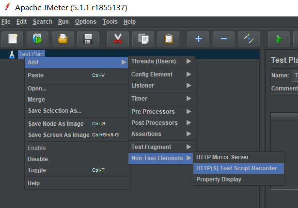
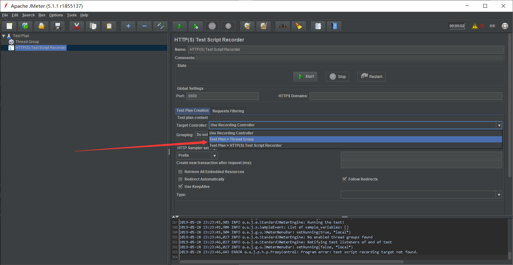
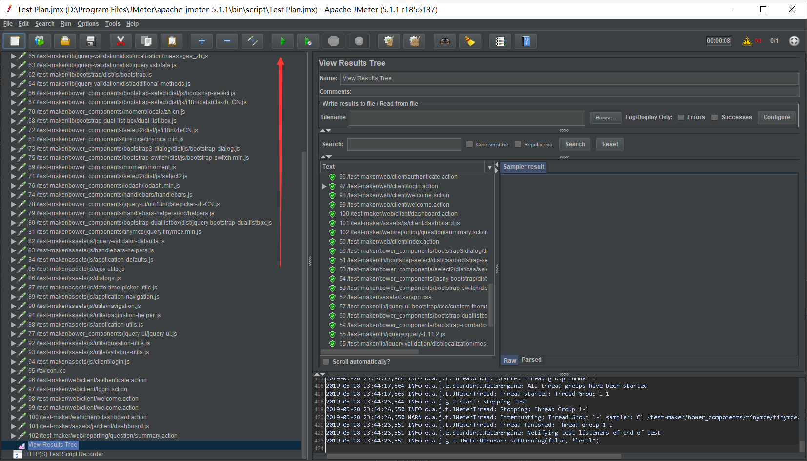

# 使用JMeter进行性能测试
By zzxn

## 1 部署JMeter

1. Requirements：JDK8+
2. 在https://jemter.apache.org下载最新Releases
3. 解压到合适的目录下
4. （可选）阅读`apache-jmeter-5.1.1/README.md`

## 2 运行JMeter

1. 切换到`apache-jmeter-5.1.1/bin`目录下
2. 运行 `jmeter` (Un*x) 或 `jmeter.bat` (Windows) 文件

> 参考文档：`apache-jmeter-5.1.1/printable_docs/`

## 3 使用JMeter进行登录功能测试

> 基本概念和用法参考《软件质量保障和测试》35页 - 44页
* Thread / Thread Group：用户
* Sampler：被测对象（选择HTTP Request）
* Synchronizing Timer：同步用户访问
* ...

> 界面中各个组件的详细解释参考 `apache-jmeter-5.1.*/printable_docs/usermanual/component_reference.html`，善用Ctrl + F查找

### 1. 新建Thread Group

1. 在Test Plan上点击右键，新建Thead Group

2. 这些之后可以按需配置，暂时保持默认设置

第一行：总用户数
第二行：访问总时间（比如设置为1代表在1秒内发完总用户数个请求，**书上是错的！** ）
第三行：测试循环次数

### 2. 新建Sampler

1. 在Test Plan上点击右键，新建脚本录制器

2. 配置脚本录制器的Target Controller为刚刚创建的Thread Group

3. 配置浏览器代理为`127.0.0.1 : 8888`（本机地址：JMeter默认端口号），各个浏览器配置方式不同
4. 在浏览器导入JMeter证书到“受信任的根证书颁发机构”，下面以Chrome为例说明配置方式：
	1. 打开设置
	2. 在设置中搜索“证书”
	3. 点击“管理证书”
	4. 选择“受信任的根证书颁发机构”
	5. 点击“导入”
	6. 导入“apache-jmeter-5.1.1\bin\ApacheJMeterTemporaryRootCA.crt”文件
	7. 一直点下一步，确认弹出的警告框
	8. 重启Chrome
5. 在脚本录制器中点击Start

6. 打开浏览器，并使用前述的代理访问http://gc21131138.imwork.net:20430/test-maker/web/client/index.action，如果出现证书问题/安全警告/无法访问等情况，说明证书导入错误
7. 输入用户名和密码，点击认证，点击登录，等待页面加载完成
8. 点击小窗口中的Stop结束录制
9. 点击刚创建的Thread Group，在第一个请求下添加一个正则提取器，我们用它来提取Session ID

10. 进行如下配置，这样我们就提取到了Set-Cookie中的JSESSIONID

11. 在Thead Group下创建一个HTTP Header Manager

12. 把刚创建的HTTP Header Manager位置移动到第一个请求之后
13. 添加如下项，这样，第一个请求后所有的请求头都带有如下Cookie，用来验证Session

14. 在Thread Group下添加下面两个Listener

15. 点击Run，测试运行

16. 点击View Result Tree，检查红圈部分显示的所有请求是否都正常，如果对`/test-maker/web/client/authenticate.action`的请求不正常，则说明10-13步有错，请仔细检查是否有拼写错误和符号、空格写错（例如中文符号）

17. 在Run之前，应该会提示你保存脚本到某个目录，现在，在那个目录下创建一个test.txt文件，最好编码为UTF-8（不带BOM），最好不要用记事本创建UTF-8格式的txt文件，然后在test.txt中以以下格式写入一些不重复的用户名和密码：（用户总数应该不少于并发访问数，否则会出现一个人同时多次登录的情况，我不确定会不会出错）

18. 在Thread Group下创建CSV Data Set Config

19. 进行如下配置

20. 设置请求体中的登录参数，引用刚才配置的两个变量username和password

20. 运行并在View Result Tree中检查登录请求，如果正常并且请求体中包含你所配置的用户名和密码说明配置正确

21. 参考教材说明，配置Thread Group中的各项参数，并在Thread Group下创建Synchronizing Timer，配置相关参数（37页）
22. 点击Aggregate Report可以查看统计信息

**重要提示：**
> 1. Aggregate Report各个列的解释参考课本下册第39页，其中时间以毫秒计
> 2. 每次运行后可以在View Results Tree和Aggregate Report上右键clear之前的数据
